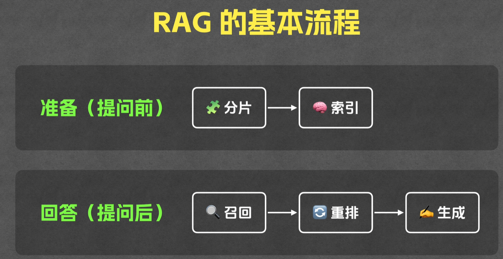
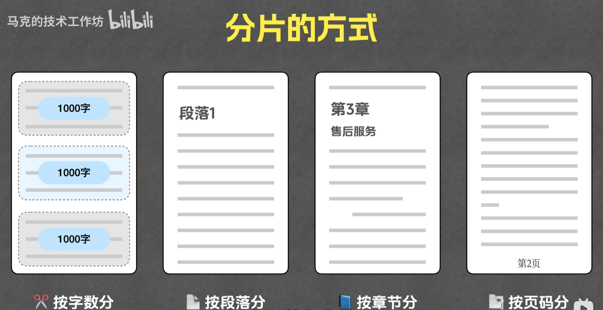
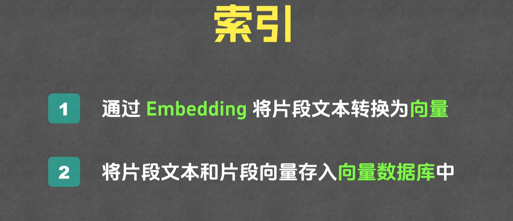
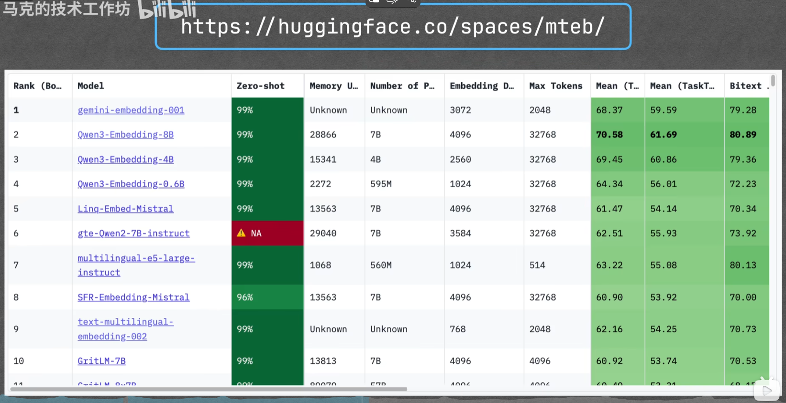
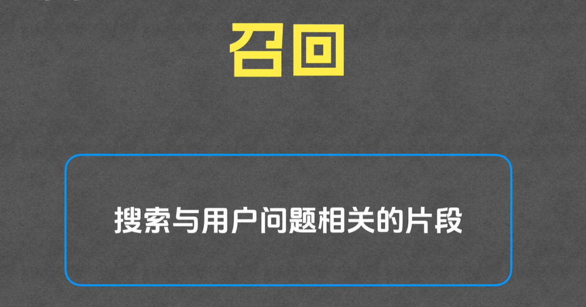
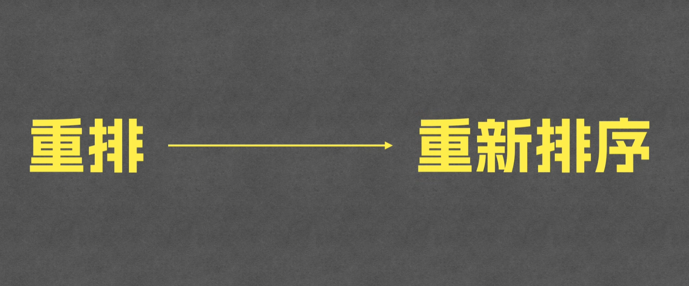
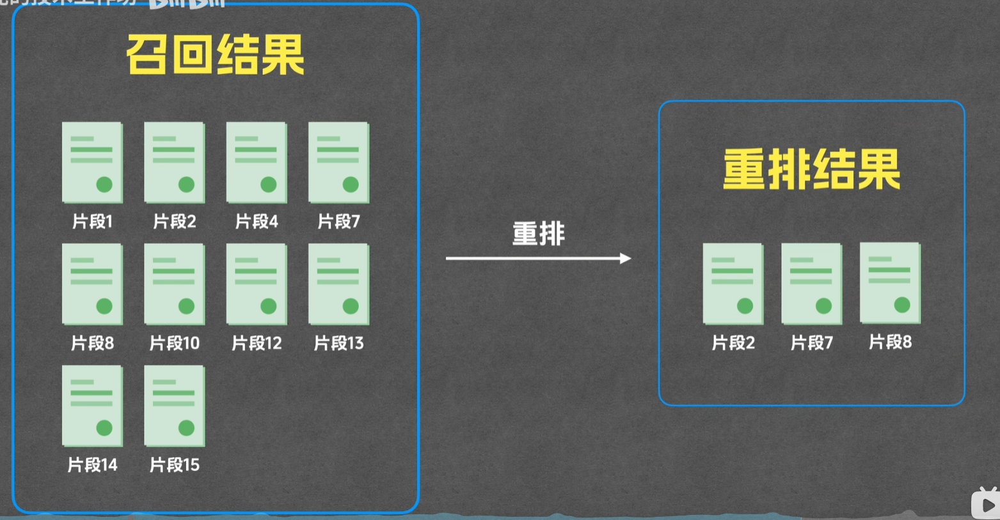
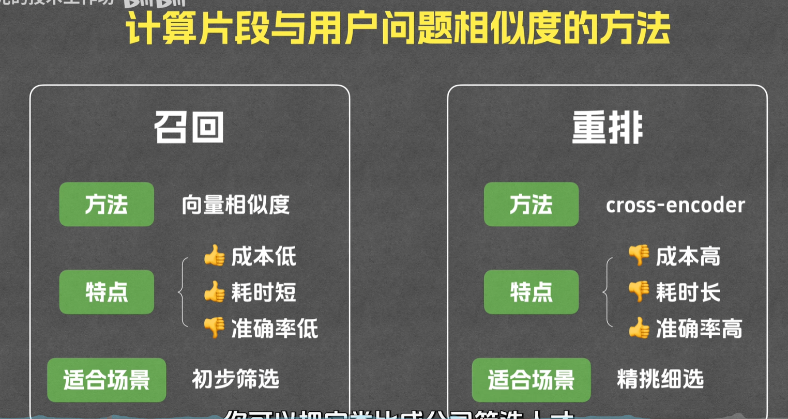

# RAG[^RAG]工作机制学习
## 基本任务：
先从资料库里检索相关内容，再基于这些内容来生成答案

## 没有RAG，直接带上内容的问题
1. 模型没法读取所有内容
2. 模型推理成本高
3. 模型推理慢
   
## RAG的基本流程

### 分片的方式

### 索引

### MTEB排行榜
https://huggingface.co/spaces/mteb/

## 召回

## 重排

[^RAG]: Retrieval-Augmented Generation 检索增强生成

